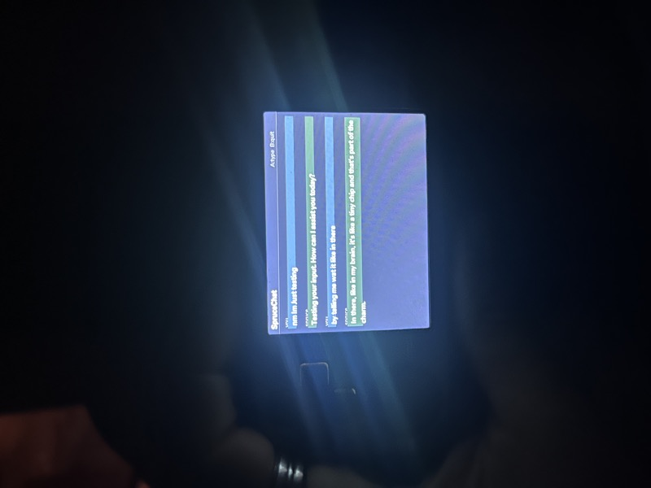
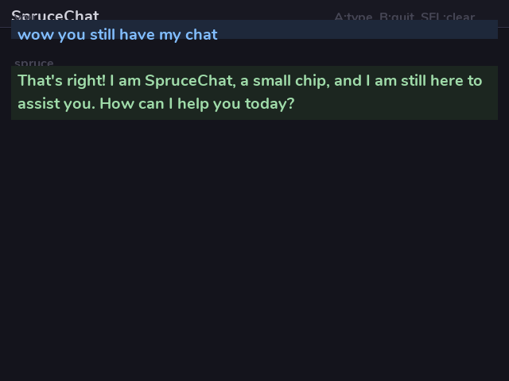

# SpruceChat

A tiny AI that lives inside your spruceOS handheld.

0.5 billion parameters. No internet. No cloud. Just you and a little language model vibing on a handheld gaming device.

## Supported devices

| Device | Architecture | Status |
|--------|-------------|--------|
| Miyoo A30 | armhf (32-bit) | Tested |
| Miyoo Flip | aarch64 (64-bit) | Tested |
| Trimui Brick | aarch64 (64-bit) | Tested |
| Trimui Smart Pro | aarch64 (64-bit) | Tested |
| Trimui Smart Pro S | aarch64 (64-bit) | Tested |

## What is this

SpruceChat runs [Qwen2.5-0.5B](https://huggingface.co/Qwen/Qwen2.5-0.5B-Instruct-GGUF) entirely on-device using [llama.cpp](https://github.com/ggerganov/llama.cpp). A persistent server keeps the model loaded in RAM so after the first boot (~60s), each message just... goes. Tokens stream in one by one so you can watch it think.

The AI has the personality of a spruce tree. Patient. Unhurried. Quietly amazed by everything.

## Quick start

Download the [latest release](https://github.com/Sundownersport/SpruceChat/releases/tag/latest) — it includes everything (both architectures and the model). Unzip `SpruceChat/` to `/mnt/SDCARD/App/` on your SD card and launch from the Apps menu.

First boot takes about a minute while the model loads into RAM. After that, you're chatting.

## Controls

| Button | What it does |
|--------|-------------|
| **A** | Open keyboard / type selected key |
| **B** | Backspace / close keyboard / quit |
| **X** | Space |
| **Y** / **START** | Send message |
| **L1** | Shift |
| **R1** | Delete |
| **SELECT** | Clear chat history |
| **MENU** | Quit |
| **D-pad** | Navigate keyboard / scroll chat |

## Wifi chat

The llama-server listens on all interfaces (`0.0.0.0:8086`). If your device is on wifi, you can open `http://<device-ip>:8086` in a browser on any device on the same network and chat through llama-server's built-in web UI. The AI runs on the handheld but you get a real keyboard.

## Performance

On the Miyoo A30 (Cortex-A7, quad-core):

- **Model load**: ~60s (one time per launch)
- **Prompt eval**: ~3 tokens/sec
- **Generation**: ~1-2 tokens/sec

64-bit devices (Flip, Brick, Smart Pro) are faster.

It's not fast. But it streams, so you see each word appear as it thinks. A short response takes 10-30s.

## How it works

`launch.sh` detects the device platform and starts the appropriate binary (`llama-server` for 64-bit, `llama-server32` for A30). The Python UI connects over localhost HTTP. The model stays in RAM between messages.

The app ships two sets of binaries and libraries:
- `llama-server` + `lib/` — aarch64 (Flip, Brick, Smart Pro, Smart Pro S)
- `llama-server32` + `lib32/` — armhf (A30)

Screen resolution and rotation are read from the spruceOS platform config. Input key codes are also read from the platform config, so controls work across all devices.

## Building from source

Builds run on GitHub Actions. Trigger manually from the Actions tab.

The workflow builds both architectures in parallel using Docker:
- **A30**: steward-fu A30 buildroot toolchain (GCC 13.2.0, glibc 2.23 sysroot)
- **Universal**: Ubuntu 20.04 aarch64-linux-gnu cross-compiler

Both builds use ccache (persisted between runs) and Docker images cached on GHCR.

To build locally, see `Dockerfile.a30` and `Dockerfile.universal` for the build environments, and `build-a30.sh` / `build-universal.sh` for the build scripts.

## Author

Originally built by [Cassius Oldenburg](mailto:connect@cassius.red). Multi-device support by Sundownersport.

## License

MIT
